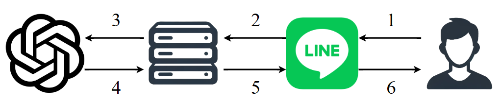
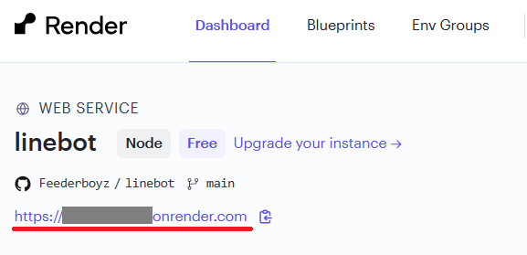

透過 API 將 Line 與 ChatGPT 串接，令使用者可透過 Line 聊天室來與 ChatGPT 進行文字對話。

## Background
**本章節提供給對串接 API 較沒有觀念的讀者閱讀**，若有相關撰寫經驗可跳過。

透過 Line 聊天室與 ChatGPT 對話一共有牽涉到三個部分：
* Line 聊天室（接收訊息）
* 伺服器（邏輯判斷）
* ChatGPT（三方套件）

運行流程如下：
1. **使用者**將文字訊息傳遞給 **Line 聊天室**
2. **Line 聊天室**將文字訊息透過 HTTP 請求，傳送至我們架設的**伺服器**
3. **伺服器**解析請求得到文字訊息，並將文字訊息透過 HTTP 請求送給 **ChatGPT**
4. **ChatGPT** 接收請求，使用 HTTP 請求回傳回應至**伺服器**
5. **伺服器**接收請求，將 ChatGPT 的回應也透過 HTTP 請求轉交給 **Line 聊天室**
6. 最後，**使用者**從 **Line 聊天室**看到回應

因此，要實現透過 Line 聊天室與 ChatGPT 溝通，除了有程式碼之外，還需要：
- 架設伺服器
- 建立 Line 機器人
- 建立 Open API Key

## Usage

### 架設伺服器
我選擇 Render 來架設伺服器，原因為它有提供免費的服務。您可以根據自己的喜好選擇其他供應商，如 Heroku 或 Google App Engine。
架設 Render 伺服器的步驟如下：
1. Render 會從您的 GitHub 來取得程式碼並用於部屬伺服器，因此先將本 repository 提交至您的 GitHub 中
2. 註冊、登入帳號
3. 進入 dashboard ，並建立 Web Service
4. 將您的 GitHub 授權給 Render
5. 填寫您部屬的 web service 的相關資訊，以下幾點為較重要的項目，請照下方說明填寫
    - Build Command: `npm i`
    - Start Command: `node index.js`
    - Environment Variables: 於後續完成建立 Line 機器人與 OpenAI API Key 後再填寫
6. 完成

### 建立 Line 機器人
該部分需透過 Line 網站實現，由於網站樣式很可能隨著時間改變，因此以下僅列出概要，並不會詳細列出每個步驟。
1. 前往 [LINE Developers](https://developers.line.biz/console/) 並登入
2. 建立 provider
3. 於剛剛建立的 provider 中，建立 Messaging API channel
    - 建立時需將 use webhook 勾選，並於 Webhook URL 填寫伺服器的 endpoint（如下圖紅線處）再加上 `/callback`
      
4. 建立後，將 channel access token 與 channel secret 記錄下來，並將其加入到伺服器的環境變數中
5. 完成
   
### 取得 OpenAI API Key
為了要使用 ChatGPT 的功能，我們需要至 OpenAI 建立帳號，並申請 API Key。

1. 登入並前往 [API keys - OpenAI API](https://platform.openai.com/api-keys)
2. 建立 secret key，並於伺服器建立儲存 secret key 的環境變數
3. 前往 setting/billing，並充值一些錢進去
    - 若只是練習用，可以只存少少的錢即可， GPT 3.5 模型很便宜，1 美元應該夠應付上百條回覆
    - Ref: [Billing overview - OpenAI API](https://platform.openai.com/account/billing/overview)
4. 完成

## Summary
該 repo 主要是幫我自己做筆記，也讓對 API 不熟悉的朋友可以有更進一步的了解。
目前僅支援使用文字訊息與 ChatGPT 對談，若需要新增額外功能，還請各位程式師自行研究 Line 與 OpenAI 對圖片、語音的 API

## Notes
- Channel access token 與 channel secret 的功能？
    - 可理解成**驗證 Line 平台與伺服器雙方的身分**，當 token 與 secret 不如預期時，代表請求可能來自駭客等非預期用戶。
- Webhook URL 的功能？
    - Line Bot 與伺服器之間的溝通是透過 http request，Line Bot 的 Webhook URL 便是**讓機器人知道要將訊息送到哪裡**。
_ 為何要設定環境變數？
    - 由於 token、secret 為機密資訊，外洩後可能令駭客可任意使用運算資源。由於在程式碼中可以透過 `process.env.ENV_VAR_NAME` 取得環境變數的數值，因此將機密變數用環境變數的方式來建立，可以降低機密外洩的情況。
- Http request 與 API 的差異？
    - ChatGPT、Line 聊天室與伺服器之間都是**透過 HTTP 請求**來進行溝通的，而 OpenAI 或 Line 所釋出的 **API**，功能為避免從頭撰寫 HTTP 請求，讓使用者可以**用簡單的方式實現彼此之間的溝通**。
